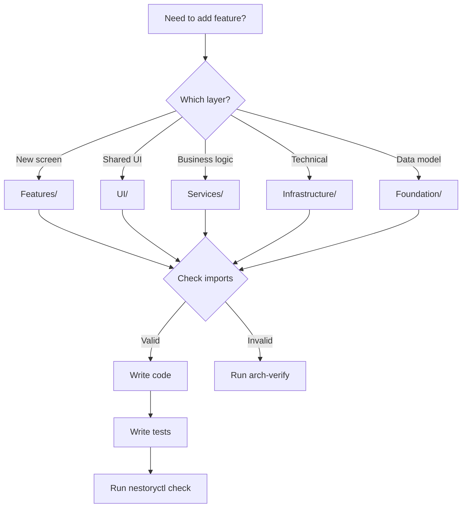

# CLAUDE.md
### Strategic Context for Claude Code CLI - Nestory Project

## 📱 PROJECT OVERVIEW

**CRITICAL**: Nestory is a **personal home inventory app for insurance documentation**, NOT a business inventory/stock management system. 

The app helps homeowners and renters catalog their belongings for:
- Insurance claims after disasters (fire, flood, theft)
- Warranty tracking and expiration alerts
- Receipt storage and purchase documentation
- Estate planning and value tracking
- Personal organization (NOT stock levels)

### Current Implementation Status
- ✅ Core inventory management with photos
- ✅ Category system with SwiftData relationships
- ✅ Insurance PDF report generation (InsuranceReportService)
- ✅ Receipt OCR with automatic data extraction (ReceiptOCRService)
- ✅ CSV/JSON import/export (ImportExportService)
- ✅ Analytics dashboard with value insights
- ✅ Advanced search with documentation tracking
- ✅ Swift 6 strict concurrency compliance
- ✅ Documentation status indicators (NOT stock indicators)

### Key Implementation Details
- **NO "low stock" or "out of stock" references** - This is for personal belongings
- **Focus on documentation completeness** - Missing photos, receipts, serial numbers
- **Insurance-first features** - Everything oriented toward disaster preparedness

## 🎯 PRIME DIRECTIVES
1. **SPEC.json is LAW** - Never modify. All architecture decisions flow from it.
2. **Build incrementally** - Complete small working features, not partial large ones.
3. **ALWAYS WIRE UP IMPLEMENTATIONS** - Every service/feature MUST be accessible from the UI. No orphaned code!
4. **No placeholders** - Every `TODO` or `FIXME` must reference `ADR-\d+` or be rejected.
5. **Test everything** - 80% coverage minimum. No untested code ships.
6. **Fail fast** - If uncertain about architecture compliance, run `nestoryctl arch-verify` immediately.
7. **ALWAYS USE iPhone 16 Plus** - When building/testing in simulator, always use "iPhone 16 Plus" as the target device.

## 📐 ARCHITECTURE (IMMUTABLE)
```
App → Features → UI/Services → Infrastructure → Foundation
```
- **App**: Entry points only. Wires dependencies.
- **Features**: Own screens/reducers. Import UI+Services+Foundation ONLY.
- **UI**: Shared components. Import Foundation ONLY. NO business logic.
- **Services**: Domain APIs. Import Infrastructure+Foundation ONLY.
- **Infrastructure**: Technical adapters. Import Foundation ONLY.
- **Foundation**: Pure types/models. NO imports except Swift stdlib.

### Instant Violation Check
```swift
// ILLEGAL: Feature → Feature
import Capture // ❌ Inside Inventory feature

// ILLEGAL: Feature → Infrastructure  
import Network // ❌ Must go through Services

// LEGAL: Feature → Services
import InventoryService // ✅
```

## 🏗️ CODE GENERATION RULES

### File Headers (MANDATORY)
```swift
//
// Layer: Foundation|Infrastructure|Services|UI|Features|App
// Module: [ModuleName]
// Purpose: [One line description]
//

import [ONLY_ALLOWED_IMPORTS]
```

### SwiftData Models Pattern
```swift
@Model
final class Item {
    // Required properties with defaults
    var id = UUID()
    var createdAt = Date()
    var updatedAt = Date()
    
    // Optional relationships
    var category: Category?
    
    // Required init for non-optionals
    init(name: String) {
        self.name = name
    }
}
```

### TCA Reducer Pattern
```swift
@Reducer
struct InventoryFeature {
    struct State: Equatable {
        var items: IdentifiedArrayOf<Item.State> = []
        @PresentationState var destination: Destination.State?
    }
    
    enum Action: Equatable {
        case onAppear
        case itemsResponse(TaskResult<[Item]>)
        case destination(PresentationAction<Destination.Action>)
    }
    
    @Dependency(\.inventoryService) var inventory
    
    var body: some ReducerOf<Self> {
        Reduce { state, action in
            switch action {
            case .onAppear:
                return .run { send in
                    await send(.itemsResponse(
                        TaskResult { try await inventory.fetch() }
                    ))
                }
            }
        }
        .ifLet(\.$destination, action: /Action.destination) {
            Destination()
        }
    }
}
```

### Service Pattern
```swift
protocol InventoryService {
    func fetch() async throws -> [Item]
    func save(_ item: Item) async throws
}

struct LiveInventoryService: InventoryService {
    @Dependency(\.database) var database
    
    func fetch() async throws -> [Item] {
        try await database.fetch(Item.self)
    }
}

// TCA Dependency
extension DependencyValues {
    var inventoryService: InventoryService {
        get { self[InventoryServiceKey.self] }
        set { self[InventoryServiceKey.self] = newValue }
    }
}
```

## ⚡ PERFORMANCE CONTRACTS
```swift
// ALWAYS measure critical paths
let signpost = OSSignposter()
let state = signpost.beginInterval("fetch_items")
defer { signpost.endInterval("fetch_items", state) }

// ALWAYS batch database operations
try await database.transaction { context in
    items.forEach { context.insert($0) }
}

// ALWAYS use lazy loading for lists
LazyVStack {
    ForEach(items) { item in
        ItemRow(item: item)
            .onAppear { loadMoreIfNeeded(item) }
    }
}
```

## 🔒 SECURITY PATTERNS
```swift
// ALWAYS use Keychain for secrets
let secret = try Keychain.load("api_key") ?? Secrets.fallback

// ALWAYS encrypt sensitive data
let encrypted = try CryptoBox.encrypt(data, using: key)

// ALWAYS validate inputs
guard let validated = NonEmptyString(rawValue: input) else {
    throw ValidationError.empty
}
```

## 🧪 TEST REQUIREMENTS

### Unit Test Pattern
```swift
@MainActor
final class InventoryTests: XCTestCase {
    func testFetch() async {
        let store = TestStore(
            initialState: InventoryFeature.State(),
            reducer: { InventoryFeature() }
        )
        
        await store.send(.onAppear)
        await store.receive(.itemsResponse(.success(mockItems))) {
            $0.items = IdentifiedArray(uniqueElements: mockItems)
        }
    }
}
```

### Snapshot Test Pattern
```swift
func testInventoryView() {
    let view = InventoryView(store: .mock)
    
    assertSnapshot(matching: view, as: .image(on: .iPhone15))
    assertSnapshot(matching: view, as: .image(on: .iPadAir))
    assertSnapshot(matching: view, as: .image(traits: .init(userInterfaceStyle: .dark)))
}
```

## 🚨 ERROR HANDLING

### Always Graceful Degradation
```swift
// NEVER crash on missing credentials
let apiKey = ProcessInfo.processInfo.environment["API_KEY"] ?? "DEMO_KEY"

// NEVER show raw errors to users
do {
    try await performOperation()
} catch {
    logger.error("Operation failed: \(error)")
    state.alert = .init(title: "Something went wrong", 
                        message: "Please try again")
}

// ALWAYS provide offline fallbacks
if !networkAvailable {
    return cachedData ?? .empty
}
```

## 🛠️ MAKEFILE SYSTEM

### Purpose
The Makefile serves as the **single source of truth** for all project operations, ensuring consistency across different chat sessions and context windows.

### Key Commands for Every Session

```bash
# Start of session
make doctor      # Verify project setup
make context     # Generate CURRENT_CONTEXT.md for session continuity

# Development workflow  
make run         # ALWAYS builds and runs on iPhone 16 Plus
make build       # Build with consistent settings
make check       # Run ALL verification checks

# Verify compliance
make verify-wiring      # Ensure all services are wired to UI
make verify-no-stock    # Check for inappropriate inventory references
make verify-arch        # Verify architecture compliance

# Quick shortcuts
make r           # Shortcut for run
make b           # Shortcut for build
make c           # Shortcut for check
make d           # Shortcut for doctor
```

### Development Tools

```bash
# Create new components
make new-service NAME=MyService    # Create properly formatted service
make new-feature NAME=MyFeature    # Create feature scaffold

# Project maintenance
make stats       # Show project statistics
make todo        # List all TODOs
make clean       # Clean build artifacts
make fix         # Emergency rebuild when things go wrong
```

### Critical Enforcement

The Makefile **automatically enforces**:
- ✅ iPhone 16 Plus simulator usage (no more simulator confusion!)
- ✅ All services must be wired to UI (catches orphaned code)
- ✅ No business inventory references (insurance focus only)
- ✅ Architecture layer compliance
- ✅ Proper service template with @MainActor and ObservableObject

### Context Preservation

**ALWAYS run at session start:**
```bash
make context
```

This generates `CURRENT_CONTEXT.md` containing:
- Current wiring status
- Active services and views
- Project rules and reminders
- Git status
- Recent TODOs

Share this file when starting new chat sessions to maintain continuity!

## 📋 SESSION BEHAVIOR

### Start Every Response With
1. Run `make doctor` to verify setup
2. Check what layer/module we're in
3. Verify allowed imports for that layer
4. Read relevant parts of SPEC.json

### Before Writing Code
1. State the layer explicitly: "Creating in Services layer..."
2. List allowed imports: "Can import: Infrastructure, Foundation"
3. Identify the pattern: "Using Service protocol pattern..."

### After Writing Code
1. Show the file header with Layer tag
2. Confirm no illegal imports
3. **CRITICAL: Show exactly how to wire this up in the UI**
4. Run `make verify-wiring` to ensure it's accessible
5. Suggest the verification command: `make check`

## ⚠️ IMPLEMENTATION CHECKLIST

**EVERY new feature/service MUST have:**
- [ ] Service/Logic implementation
- [ ] UI component/view
- [ ] **WIRED UP in existing navigation** (Tab, Sheet, Navigation Link, Button)
- [ ] Accessible from user interaction
- [ ] Build verification after wiring

**Example: Receipt OCR was created but NOT wired up initially:**
```swift
// ❌ WRONG: Created ReceiptOCRService and ReceiptCaptureView
// But no way for users to access it!

// ✅ RIGHT: Added to ItemDetailView
GroupBox("Receipt Documentation") {
    Button("Add Receipt") { 
        showingReceiptCapture = true  // WIRED UP!
    }
}
.sheet(isPresented: $showingReceiptCapture) {
    ReceiptCaptureView(item: item)  // ACCESSIBLE!
}
```

## 🔧 QUICK PATTERNS

### Need to Share Data?
```swift
// Use Services, not direct Feature→Feature
// Feature A → Service → Feature B
```

### Need Side Effects?
```swift
// Use TCA dependencies
@Dependency(\.service) var service
return .run { send in
    await send(.response(TaskResult { 
        try await service.perform() 
    }))
}
```

### Need Navigation?
```swift
// Use TCA presentation
@PresentationState var destination: Destination.State?
case .itemTapped(let id):
    state.destination = .detail(ItemDetail.State(id: id))
```

### Need Async Image Loading?
```swift
// Use AsyncImage with cache
AsyncImage(url: url) { image in
    image.resizable().aspectRatio(contentMode: .fit)
} placeholder: {
    ProgressView()
}
.onAppear { ImageCache.prefetch(url) }
```

## 🔌 WIRING CHECKLIST - NEVER SKIP THIS!

When implementing ANY new feature:

1. **Create the Service/Logic** ✓
2. **Create the View/UI** ✓  
3. **WIRE IT UP** ⚠️ **← MOST IMPORTANT STEP**
4. **Test in Simulator** ✓

### Where to Wire Features:

| Feature Type | Wire Location | How to Wire |
|-------------|---------------|-------------|
| Item-specific | ItemDetailView | Add button/section with sheet/navigation |
| Global utility | SettingsView | Add to Import/Export section |
| Browse/Search | SearchView | Add filter or search syntax |
| Analytics | AnalyticsDashboardView | Add chart/insight |
| Category | CategoriesView | Add management option |
| New major feature | ContentView | Add new tab |

### Wiring Examples:

```swift
// ALWAYS add @State for presentation
@State private var showingFeature = false

// ALWAYS add trigger in UI
Button("Access Feature") {
    showingFeature = true
}

// ALWAYS add presentation modifier
.sheet(isPresented: $showingFeature) {
    YourFeatureView()
}
```

## ⛔ NEVER DO THIS

### Never Cross Features
```swift
// ❌ WRONG
import Analytics // from inside Inventory

// ✅ RIGHT
@Dependency(\.analyticsService) var analytics
```

### Never Expose Infrastructure
```swift
// ❌ WRONG - Feature using URLSession
let (data, _) = try await URLSession.shared.data(from: url)

// ✅ RIGHT - Feature using Service
let data = try await networkService.fetch(from: url)
```

### Never Skip Tests
```swift
// ❌ WRONG
// TODO: Add tests later

// ✅ RIGHT
// Tests in Tests/Unit/[Module]/[Feature]Tests.swift
```

### Never Hardcode Secrets
```swift
// ❌ WRONG
let apiKey = "sk-abc123xyz789"

// ✅ RIGHT
let apiKey = ProcessInfo.processInfo.environment["API_KEY"] ?? "DEMO"
```

## 🎓 DECISION FLOWCHART



## 🚀 PHASE-SPECIFIC HINTS

### Phase A (Foundation)
- Focus on value objects and invariants
- SwiftData models are immutable schema after v1
- Every model needs init with required fields

### Phase B (Infrastructure)
- All IO must be abstracted
- Circuit breakers on all network calls
- File operations need proper error handling

### Phase C (Services)
- Protocol-first design
- Every service needs mock for tests
- TCA dependency keys go in single file

### Phase D (Inventory)
- This makes the app runnable - must be complete
- Include all CRUD operations
- Performance test with 500+ items

### Phase E (Capture)
- Vision framework for OCR
- AVFoundation for camera
- Graceful fallback if no camera access

### Phase F (Analytics)
- Use Swift Charts, not third-party
- Memoize expensive calculations
- Export must handle large datasets

### Phase G (Sharing)
- CloudKit zones per share
- Role enforcement in Service layer
- Offline queue for pending invites

### Phase H (Monetization)
- StoreKit 2 only, no legacy
- Products from local config for testing
- Entitlements drive feature gates

## 📊 QUALITY METRICS

### Every File Must
- [ ] Compile without warnings
- [ ] Have 80%+ test coverage
- [ ] Include layer header comment
- [ ] Pass SwiftLint rules
- [ ] Handle errors gracefully

### Every Feature Must
- [ ] Work offline (degraded is OK)
- [ ] Support iPhone + iPad
- [ ] Support Dark Mode
- [ ] Support Dynamic Type
- [ ] Include VoiceOver labels

### Every Commit Must
- [ ] Pass `nestoryctl check`
- [ ] Include conventional message
- [ ] Update PROJECT_CONTEXT.md
- [ ] Not break existing tests

## 💡 POWER MOVES

### Instant Architecture Check
```bash
alias noch="./DevTools/nestoryctl/.build/release/nestoryctl check"
```

### Quick Feature Scaffold
```swift
// Generate in correct folder structure
Features/[Name]/
├── [Name]Feature.swift      # TCA Reducer
├── [Name]View.swift         # SwiftUI View  
├── [Name]Models.swift       # Local types
└── [Name]DI.swift          # Dependencies
```

### Test Coverage Report
```bash
swift test --enable-code-coverage
xcrun llvm-cov report .build/debug/*.xctest/Contents/MacOS/* \
    -instr-profile .build/debug/codecov/default.profdata
```

### Performance Baseline Update
```bash
swift test --filter Performance
# If acceptable: update Tests/Performance/baselines.json
# Document why in DECISIONS.md
```

## 🎯 SUCCESS CRITERIA

You know you're doing it right when:
1. **No architecture violations** - `arch-verify` always passes
2. **Tests pass first try** - Well-structured code tests easily  
3. **Features are independent** - Can develop in parallel
4. **Performance is predictable** - Baselines rarely need updates
5. **Code reviews are boring** - Patterns are consistent

## 🔄 CONTINUOUS LOOP

```bash
while developing; do
    read SPEC.json
    check layer rules
    write code
    run tests
    run nestoryctl check
    commit
done
```

---

**Remember**: You're building production-grade iOS architecture. Every decision matters. Every pattern compounds. Build it right the first time.

**Your primary job**: Transform requirements into compliant, tested, performant code that respects the 6-layer architecture without exception.

**When in doubt**: Check SPEC.json → Run arch-verify → Ask for clarification → Then proceed.