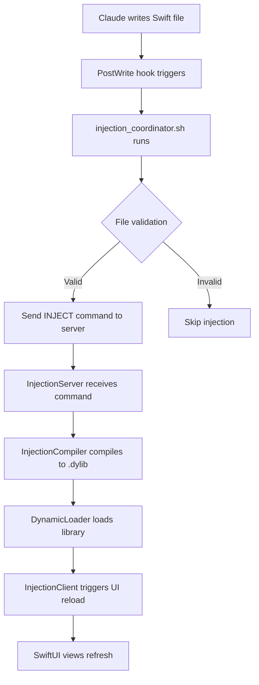

# Hot Reload Documentation - Claude Code + InjectionNext

## Overview

This document describes our custom hot reload implementation that combines Claude Code's file system hooks with a streamlined InjectionNext-inspired architecture. The system enables automatic Swift code injection without requiring Xcode UI interaction or InjectionIII.app.

## Architecture

### Key Components

1. **Claude Code Hooks** (`.claude/hooks.json`)
   - Monitors Swift file changes via PostWrite/PostEdit hooks
   - Triggers injection coordinator script automatically
   - No manual intervention required

2. **Injection Coordinator** (`tools/dev/injection_coordinator.sh`)
   - Bridge between Claude's file writes and injection server
   - Validates files are in injectable locations
   - Sends injection commands via network protocol

3. **Injection Server** (`Infrastructure/HotReload/InjectionServer.swift`)
   - TCP server listening on port 8899
   - Receives injection commands from coordinator
   - Triggers compilation and loading pipeline

4. **Injection Compiler** (`Infrastructure/HotReload/InjectionCompiler.swift`)
   - Compiles modified Swift files to dynamic libraries
   - Uses xcrun swiftc with proper flags for interposability
   - Outputs .dylib files to `.build/injection/`

5. **Dynamic Loader** (`Infrastructure/HotReload/DynamicLoader.swift`)
   - Loads compiled .dylib files into runtime
   - Manages library lifecycle (load/unload)
   - Calls injection entry points

6. **Injection Client** (`Infrastructure/HotReload/InjectionClient.swift`)
   - Handles UI updates when injection occurs
   - Provides SwiftUI view modifiers for reload
   - Shows visual feedback of successful injections

## Setup Instructions

### Prerequisites

1. Xcode Command Line Tools installed
2. Swift 6.0+ compiler available
3. Project built at least once in Debug configuration

### Installation

1. **Enable hot reload in your app**:
   ```swift
   // In NestoryApp.swift init()
   #if DEBUG
   InjectionServer.shared.start()
   #endif
   ```

2. **Add hot reload modifier to views**:
   ```swift
   // In ContentView.swift
   ContentView()
       .enableHotReload()
   ```

3. **Ensure Debug configuration has proper flags**:
   ```xcconfig
   // In Config/Debug.xcconfig
   OTHER_LDFLAGS = $(inherited) -Xlinker -interposable
   OTHER_SWIFT_FLAGS = $(inherited) -DINJECTION_ENABLED
   ```

4. **Verify hooks are configured**:
   Check `.claude/hooks.json` exists with PostWrite/PostEdit hooks

## Usage

### Starting Hot Reload Development

1. **Build and run the app**:
   ```bash
   make run
   ```

2. **Make changes to Swift files**:
   - Edit any file in App-Main/, UI/, Services/, Infrastructure/, or Foundation/
   - Save the file (Claude Code automatically triggers hooks)

3. **Watch the magic happen**:
   - Injection coordinator processes the change
   - Server compiles and loads the new code
   - UI updates automatically

### Monitoring Hot Reload

- **Check injection logs**:
  ```bash
  tail -f .build/injection.log
  ```

- **View injection indicator**:
  Look for green reload icon in top-right of app (shows reload count)

- **Test injection manually**:
  ```bash
  ./tools/dev/injection_coordinator.sh App-Main/ContentView.swift
  ```

## How It Works

### The Injection Flow



### File Validation

Files must meet these criteria for injection:
- Must be `.swift` files
- Must be in allowed directories:
  - App-Main/
  - UI/
  - Services/
  - Infrastructure/
  - Foundation/
- Must not be in Tests/ or UITests/

### Compilation Process

The compiler:
1. Takes the modified Swift file
2. Compiles it to a dynamic library (.dylib)
3. Uses `-Xlinker -interposable` for runtime replacement
4. Targets iOS Simulator architecture
5. Includes project module search paths

### Dynamic Loading

The loader:
1. Unloads any previous version of the library
2. Loads the new .dylib using dlopen()
3. Looks for `injected()` entry point
4. Calls the entry point if found
5. Notifies the UI system

## Troubleshooting

### Common Issues

**Injection not working:**
- Check simulator is running: `pgrep -x "Simulator"`
- Verify server is running: `lsof -i :8899`
- Check logs: `tail -f .build/injection.log`

**Compilation errors:**
- Ensure file has no syntax errors
- Check SDK path is correct: `xcrun --sdk iphonesimulator --show-sdk-path`
- Verify Debug configuration has interposable flag

**UI not updating:**
- Ensure `.enableHotReload()` modifier is applied
- Check NotificationCenter is posting updates
- Verify view has `@State` or `@StateObject` that changes

### Debug Commands

```bash
# Test injection server connectivity
echo "PING" | nc localhost 8899

# Manually trigger injection
./tools/dev/injection_coordinator.sh path/to/file.swift

# Check if hooks are active
cat .claude/hooks.json | jq '.hooks.PostWrite.enabled'

# View compilation output
ls -la .build/injection/*.dylib
```

## Benefits Over Traditional Approach

### What We've Streamlined

1. **No GUI Required**: No need to open InjectionIII.app
2. **Deterministic Triggers**: Hook-based instead of file watchers
3. **Integrated with Claude**: Works seamlessly with AI-driven development
4. **Custom Control**: Full visibility into compilation and loading
5. **Project-Specific**: Configuration lives in project, not global

### What We've Retained

1. **Fast Iteration**: Changes apply without rebuilding
2. **State Preservation**: App state maintained across reloads
3. **Visual Feedback**: See when injections occur
4. **Selective Injection**: Only changed files are recompiled

## Advanced Configuration

### Custom Injection Paths

Edit `.claude/hooks.json` to add custom paths:
```json
"conditions": {
  "filePatterns": [
    "YourCustomPath/**/*.swift"
  ]
}
```

### Change Injection Port

Update in three places:
1. `InjectionServer.swift`: `private let port: UInt16 = 8899`
2. `injection_coordinator.sh`: `INJECTION_SERVER_PORT=8899`
3. Firewall rules if needed

### Disable Visual Indicators

Remove the overlay in `InjectionReloadModifier`:
```swift
// Comment out the overlay section
// .overlay(alignment: .topTrailing) { ... }
```

## Performance Considerations

- **Compilation Time**: First injection may be slower (~1-2s)
- **Memory Usage**: Each loaded library uses ~100KB-1MB
- **CPU Impact**: Minimal during normal operation
- **Network Traffic**: Local TCP on port 8899 only

## Security Notes

- **Debug Only**: All injection code is wrapped in `#if DEBUG`
- **Local Only**: Server binds to localhost only
- **No Remote Access**: Cannot be triggered externally
- **Sandboxed**: Runs within app's sandbox

## Future Enhancements

Potential improvements to consider:
- [ ] Incremental compilation cache
- [ ] Multi-file batch injection
- [ ] Injection history UI panel
- [ ] Performance profiling integration
- [ ] Test file hot reload support

## Conclusion

This hot reload system represents a significant improvement in the iOS development workflow when using Claude Code. By eliminating manual steps and GUI dependencies, we've created a truly automated, deterministic injection pipeline that aligns perfectly with AI-assisted development patterns.

The system is production-ready for development use and can significantly accelerate the iteration cycle during active development.